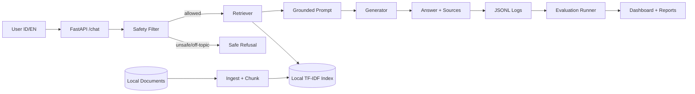

# Architecture

## Components

- FastAPI: serving `/health` and `/chat`.
- Safety filter: blocks toxic, off-topic, prompt-injection, and system leakage requests.
- Retriever: local lexical TF-IDF search over chunked local documents.
- Generator: fake extractive generator by default, or OpenAI-compatible API.
- Logger: JSONL structured logs with request ID, latency, token estimate, retrieval stats, and refusal reason.
- Evaluation: gold set runner with quality, safety, latency, and cost metrics.

